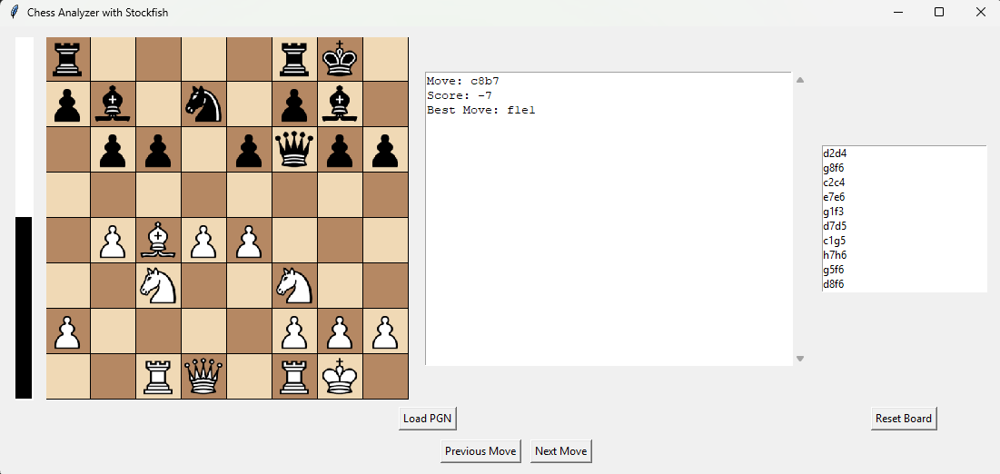

# Python GUI Chess Game Analysis with Stockfish



This application allows users to analyze chess games using Stockfish engine, visualize the chessboard, read move reviews by AI coach and track game moves with a dynamic evaluation bar.

## Table of Contents

- [Python GUI Chess Game Analysis with Stockfish](#python-gui-chess-game-analysis-with-stockfish)
  - [Table of Contents](#table-of-contents)
  - [Features](#features)
  - [Installation](#installation)
  - [Usage](#usage)
  - [Files Structure](#files-structure)

## Features

- **Chessboard Visualization:** Display the chessboard with pieces loaded from PNG files.
- **PGN File Loading:** Load a PGN file to analyze a game's moves.
- **Move Navigation:** Navigate through game moves, both forward and backward.
- **AI Assistant & Coaching Feedback:** Leverages an AI-powered assistant to review each move, providing human-readable analysis and suggestions — acting like a virtual chess coach.
- **Evaluation Bar:** Visualize the evaluation score dynamically with a split bar indicating advantage for white and black sides.
- **Move History:** Display the history of moves made in the game.
- **Stockfish Integration:** Use Stockfish engine for game analysis and evaluation.

## Installation

1. **Clone the Repository:**
   ```bash
   git clone [https://github.com/your-username/Chess-Game-Analysis.git](https://github.com/mominalix/Python-GUI-Chess-Game-Analysis-with-Stockfish.git)
   cd Chess-Game-Analysis
   ```

2. **Install Dependencies:**
   ```bash
   pip install -r requrements.txt
   ```

3. **Download Stockfish:**
   - Download the appropriate Stockfish binary for your operating system from [Stockfish Official Site](https://stockfishchess.org/download/).
   - Place the downloaded executable (.exe) file in the gui.py (line 17).
     
4. **Add openAI key:**
    - Go to gpt_api.py file and replace OPEN_AI_API_KEY with your private key. (line 9).

## Usage
    
1. **Run FastAPI application:**
    ```bash
   uvicorn gpt_api:app --reload
   ```

2. **Open new terminal and run the Application:**
   ```bash
   python main.py
   ```

3. **Load a PGN File:**
   - Click on the "Load PGN" button to load a PGN file containing a chess game.

4. **Navigate Through Moves:**
   - Use the navigation buttons ("Next Move" and "Previous Move") to move forward or backward through the game moves.

5. **Move Pieces on the Board:**
   - Click on a piece and then click on its destination square to make a move on the chessboard.

6. **Reset the Board:**
   - Click on the "Reset Board" button to reset the board to the initial state.

7. **Analysis Bar:**
   - The vertical bar on the left side of the board dynamically shows the evaluation score from Stockfish, split to indicate advantage for white and black sides.

8. **Move Review by AI assistant**
    - On the left side of the board, users can view AI-powered move analysis and coaching tips, helping them understand the quality of their moves.
      
9. **Quit the Application:**
   - Close the application window or press `Ctrl+C` in the terminal to exit.

## Files Structure

```
Chess-Game-Analysis/
│
├── main.py                # Main application entry point
├── gui.py                 # GUI setup and interaction
├── gpt_api.py             # api key setup and prompt
├── engine.py              # Chess engine integration (Stockfish)
├── move_history.py        # Move history management
├── navigation.py          # Navigation buttons for moves
├── sample.png            # Sample screenshot of the application
├── stockfish/             # Directory for Stockfish engine
│   └── stockfish.exe      # Stockfish executable (platform specific)
├── assets/                # Directory for chess piece images
│   └── piece_images/      # Directory containing piece images (wp.png, bp.png, etc.)
└── README.md              # Documentation file
```
